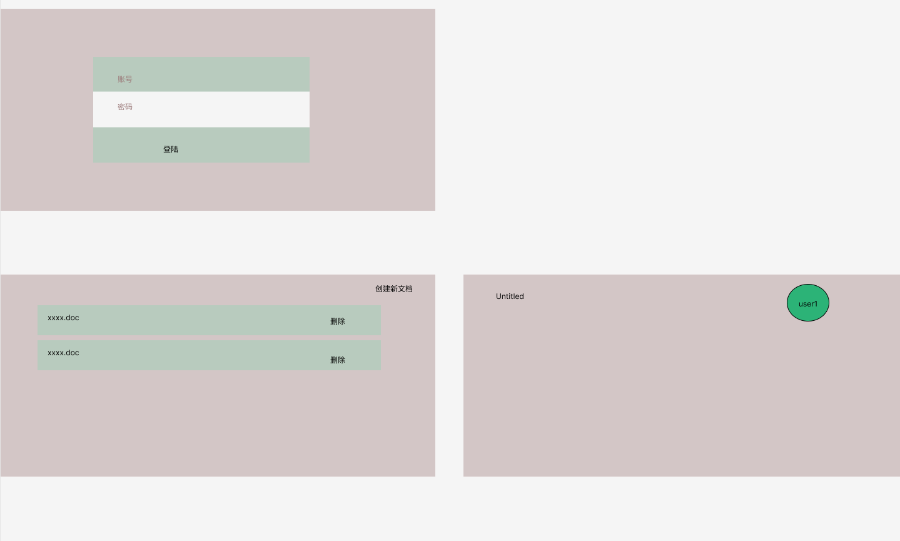

# co_editor
# 技术栈
- 前端采用svelte + yjs / blocky(Block)
- 后端使用了phoenix
- 数据库暂时使用了postgresql
- REPL(kernel): 
  - CRDT Analyser：[loom](https://github.com/asonge/loom) / [delta_crdt_ex](https://github.com/derekkraan/delta_crdt_ex?tab=readme-ov-file) / [drax](https://github.com/keathley/drax)
- LLM Support: [Elixir LangChain](https://github.com/brainlid/langchain) / [Task weaver](https://github.com/microsoft/TaskWeaver)

# 前端页面
，demo中设计了三个页面：
- 登陆页面（注册功能不是主要的，暂时在db中写死两个用户）
- 文档的管理页面，有三个功能：
  - 右上角点击之后能够创建一个新的空白文档，
  - 暂时不引入文档所有权的问题，只要是这个系统中有的文档就任何用户都可以写入，编辑，删除
  - 当点开了一个文档后，会将该文档的内容显示在页面上

用户编辑文档页面的操作：
- 字符输入操作，特指键入的字符
- 用户采用`/table, /img`可以导入文本，图片（当然可以拓展到audio，href数据）

LLM支持：
- 用户采用`/ai`可以与LLM进行交互，交互内容为当前行文本数据

# 后端
- 通过管理webrtc room，来管理docs
- 通过db保存旧版本docs，优先加载旧版本docs，再通过webrtc获取新版本docs
- CRDT Analyser
- REPL 解析前端指定handle方法，如`/table`,`/img`,`/ai`
