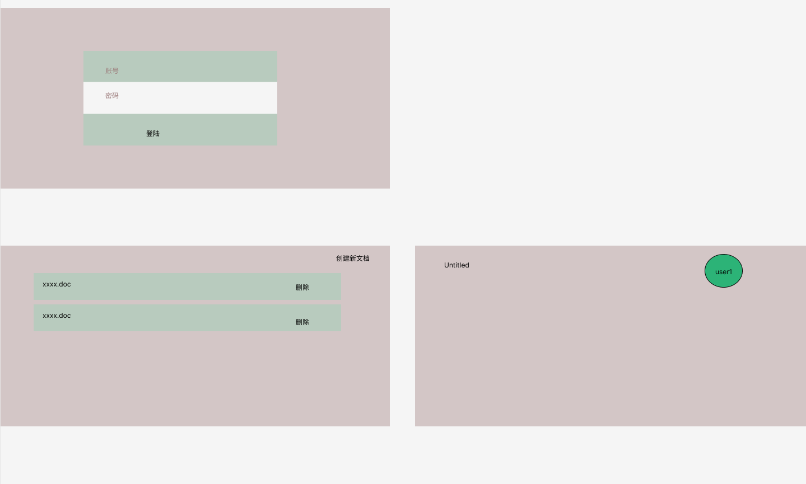
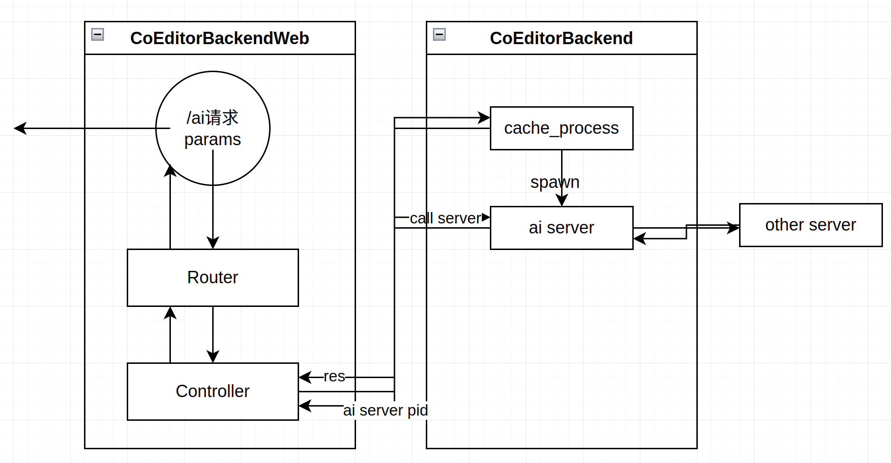
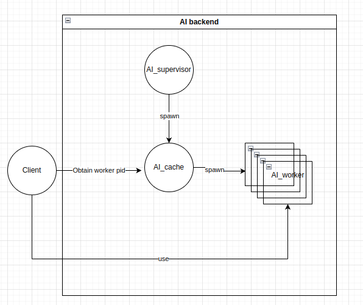
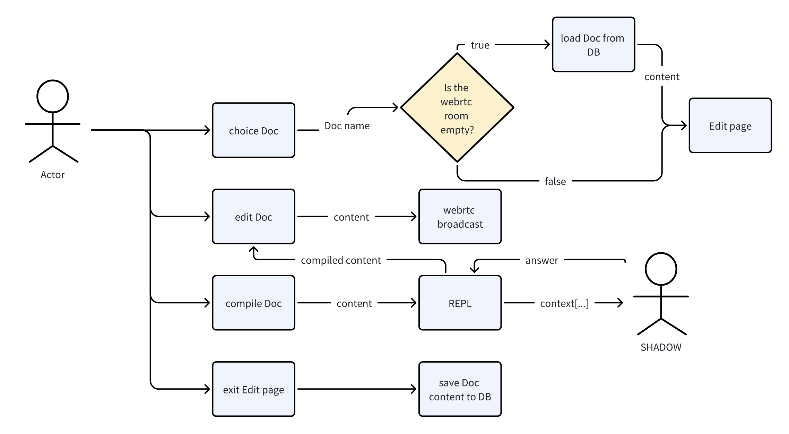

# co_editor
# 技术栈
- 前端采用svelte + yjs / blocky(Block)
- 后端使用了phoenix
- 数据库暂时使用了postgresql
- REPL
- LLM Support: SHADOW

# 前端页面
，demo中设计了三个页面：
- 登陆页面（注册功能不是主要的，暂时在db中写死两个用户）
- 文档的管理页面，有三个功能：
  - 右上角点击之后能够创建一个新的空白文档，
  - 暂时不引入文档所有权的问题，只要是这个系统中有的文档就任何用户都可以写入，编辑，删除
  - 当点开了一个文档后，会将该文档的内容显示在页面上

用户编辑文档页面的操作：
- 字符输入操作，特指键入的字符
- 用户采用`/table, /img`可以导入文本，图片（当然可以拓展到audio，href数据）

LLM支持：
- 用户采用`/ai`可以与LLM进行交互，交互内容为当前行文本数据

# 后端
- 通过管理webrtc room，来管理docs
- 通过db保存旧版本docs，优先加载旧版本docs，再通过webrtc获取新版本docs
- CRDT Analyser
- REPL 解析前端指定handle方法，如`/table`,`/img`,`/ai`

## `/ai`后端处理逻辑

，启动之后，这个部分actor之间的关系为：

启动逻辑

### DB设计
- Doc Table，存放Doc数据,包括3个字段: 
  - `doc_name`, 文档名
  - `doc_room`, 该文档对应的WebRTC房间编号
  - `doc_content`, 文档内容

# 用况图
用户在`文档列表`页面可以选择某一文档，进入`编辑文档`页面，该页面支持多个用户共同编辑同一个文档。
在`编辑文档`页面，通过输入`/ai`，可以调用LLM生成相关内容，帮助完成编辑文档的工作。

[接口文档](/docs/api_interface.md)
